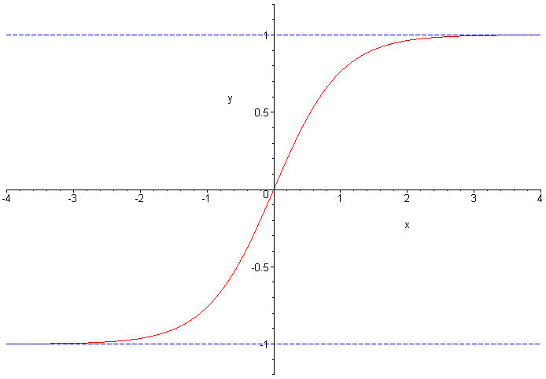

# Hyper-parameters

Tuning hyper-parameters is an empirical process. Plot the cost J against various values of each hyper-parameter and look for the ideal values.

- Learning rate
- Number of iterations
- Number of hidden layers
- Number of hidden units in a layer
- Choice of activation function

# Regularization

In simple terms, regularization is tuning or selecting the preferred level of model complexity so your models are better at predicting (generalizing). If you don't do this your models may be too complex and overfit or too simple and underfit, either way giving poor predictions.

Regularization trades higher bias in the training set for low variance so that the predictions would be more accurate.

## L2 regularization

By adding an additional penalty term to the cost function  ($\frac{\lambda}{2m} \sum ||W^{[l]}||^2$), large values of $W$ are penalized and this has the effect of bringing the impact of a lot of the hidden units to 0. This reduces the chance of picking up small noises leading to overfitting.

Another intuition is that large values of $\lambda$ forces $W$ to be small. And since $z^{[l]} = W^{[l]} * a^{[l-1]} + b$, small values of W keeps z small. When z is smaller, the gradient is relatively linear (for example, tanh). Linear hidden layers are not as good as picking up non-linear decision boundary so it will reduce overfitting.

## Dropout

In dropout, neurons are dropped stochastically based on a drop-out rate.

Dropout can be seen as an extreme version of bagging. At each training step in a mini-batch, the dropout procedure creates a different network (by randomly removing some units), which is trained using backpropagation as usual. Conceptually, then, the whole procedure is akin to using an ensemble of many different networks (one per step) each trained with a single sample (i.e. extreme bagging).

At test time the whole network is used (all units) but with scaled down weights. Mathematically this approximates ensemble averaging (using the geometric mean as average).

Dropout in deep learning works as follows: one or more neural network nodes is switched off  once in a while so that it will not interact with the network (it weights cannot be updated, nor affect the learning of the other network nodes). With dropout, the learned weights of the nodes become somewhat more insensitive to the weights of the other nodes and learn to decide somewhat more by their own (and less dependent on the other nodes they're connected to). In general, dropout helps the network to generalize better and increase accuracy since the (possibly somewhat dominating) influence of a single node is decreased by dropout.

In inverted drop out, nodes are dropped stochastically based on a keep_prob parameter. For example, if the keep_prob parameter is .6, then there is a 40% chance a node will be dropped. The higher keep_prob is, the lower the regularization effect and higher the training accuracy becomes. All activation values are adjusted up by a factor of 1/keep_prob to keep the expected value the same. At test time, no dropout  / adjustment is needed.

## Other method

- Data augmentation: create fake training examples by transforming the data (e.g. rotating images)
- Early stopping: stop at the iteration at which the evaluation set error starts to increase

# Exploding / vanishing gradient

When individual weights are either very big or very small, we have issues with exploding / vanishing gradient. Exploding gradient is an issue because gradient based optimization methods use the value of the gradient to define the direction to optimize the network parameters. Exploding gradients means that the neural network is going to be unable to learn long-term temporal relations.

Vanishing gradient is an issue because learning becomes really slow as the gradient becomes smaller because it takes much longer to reach optimal.

ReLU is good addressing vanishing gradient because the derivative is either 0 or 1, so you either have active or inactive nodes but never really small values.

One way to address this, we adjust the initialization of weights in the beginning according to the number of features (Xavier initialization). The bigger the number of features is, the smaller we want the weights to be. In practice, for ReLU, we initialize the weights as below:

$$w^{[l]} = np.random.randn(shape) * np.sqrt(\frac{2}{n^{[l-1]}})$$

For tanh, we use np.sqrt($\frac{1}{n^{[l-1]}}$).

Another way is to use weight decay, which is to multiply the weight at each layer by a factor smaller than 1 to keep the weights from growing.

# Gradient checking

To confirm that our gradient calculation is correct, we can use gradient checking.

Recall that the definition of derivative is:

$$f'(\theta) = \lim_{\epsilon \rightarrow 0} \frac{f(\theta + \epsilon) - f(\theta - \epsilon)}{2\epsilon}$$

Let $\delta \theta$ be the vectorization of all the individual $\delta w$ and $\delta b$.

Then our calculated gradient should approximate the calculation above. That is:

$$\delta \theta_{\text{approx}}[i] = \frac{J(\theta_1, \theta_2, ... , \theta_i + \epsilon) - J(\theta_1, \theta_2, ... , \theta_i - \epsilon)}{2\epsilon} \approx \delta \theta[i] $$

And that:

$$\delta \theta_{\text{approx}} \approx \delta \theta $$

We can define approximation with the Eucleadian distance:

$$ \frac{||\delta \theta_{\text{approx}} - \delta \theta||_2}{||\delta \theta_{\text{approx}}||_2 + ||\delta \theta||_2} \approx [10^{-7}, 10^{-5}] $$

given that $\epsilon = 10^{-7}$

# Quiz

If you have 10,000,000 examples, how would you split the train/dev/test set?

- 98% train . 1% dev . 1% test

The dev and test set should:

- Come from the same distribution

If your Neural Network model seems to have high bias, what of the following would be promising things to try? (Check all that apply.)

- Increase the number of units in each hidden layer
- Make the Neural Network deeper

You are working on an automated check-out kiosk for a supermarket, and are building a classifier for apples, bananas and oranges. Suppose your classifier obtains a training set error of 0.5%, and a dev set error of 7%. Which of the following are promising things to try to improve your classifier? (Check all that apply.)

- Increase the regularization parameter lambda
- Get more training data

What is weight decay?

- A regularization technique (such as L2 regularization) that results in gradient descent shrinking the weights on every iteration.

What happens when you increase the regularization hyperparameter lambda?

- Weights are pushed toward becoming smaller (closer to 0)

With the inverted dropout technique, at test time:

- You do not apply dropout (do not randomly eliminate units) and do not keep the 1/keep_prob factor in the calculations used in training

Increasing the parameter keep_prob from (say) 0.5 to 0.6 will likely cause the following: (Check the two that apply)

- Reducing the regularization effect
- Causing the neural network to end up with a lower training set error

Which of these techniques are useful for reducing variance (reducing overfitting)? (Check all that apply.)

- L2 regularization
- Data augmentation
- Dropout

Why do we normalize the inputs
- It makes the cost function faster to optimize
